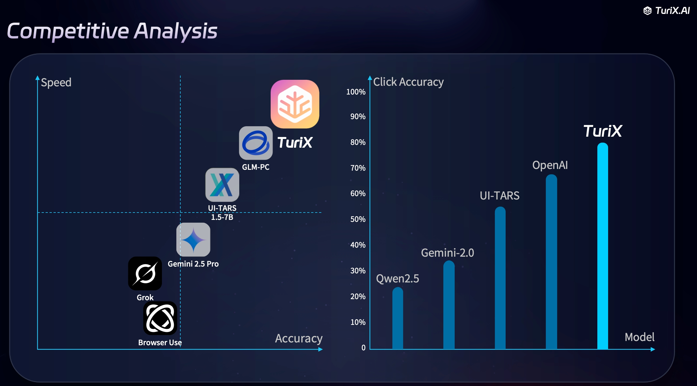

<p align="center">
   
</p>

<h1 align="center">TuriX · Desktop Actions, Driven by AI</h1>

<p align="center"><strong>Talk to your computer, watch it work.</strong></p>

<p align="center">
  <a href="README.md">English</a> | <a href="README.zh-CN.md">中文</a>
</p>

## 📞 Contact & Community

Join our Discord community for support, discussions, and updates:

<p align="center">
   <a href="https://discord.gg/yaYrNAckb5">
      
   </a>
</p>

Or contact us with email: contact@turix.ai

TuriX lets your powerful AI models take real, hands‑on actions directly on your desktop. 
It ships with a **state‑of‑the‑art computer‑use agent** (passes > 68 % of our internal OSWorld‑style test set) yet stays 100 % open‑source and cost‑free for personal & research use.  

Prefer your own model? **Change in `config.json` and go.**

## Table of Contents
- [📞 Contact & Community](#-contact--community)
- [🤖 OpenClaw Skill](#-openclaw-skill)
- [📰 Latest News](#-latest-news)
- [🖼️ Demos](#️-demos)
- [✨ Key Features](#-key-features)
- [📊 Model Performance](#-model-performance)
- [🚀 Quick‑Start (macOS 15+)](#-quickstart-macos-15)
   - [1. Download the App](#1-download-the-app)
   - [2. Create a Python 3.12 Environment](#2-create-a-python-312-environment)
   - [3. Grant macOS Permissions](#3-grant-macos-permissions)
      - [3.1 Accessibility](#31-accessibility)
      - [3.2 Safari Automation](#32-safari-automation)
   - [4. Configure & Run](#4-configure--run)
   - [4.4 Skills (Optional)](#44-skills-optional)
- [🤝 Contributing](#-contributing)
- [🗺️ Roadmap](#️-roadmap)

---

## 🤖 OpenClaw Skill

Use TuriX via OpenClaw with our published skill on ClawHub:  
https://clawhub.ai/Tongyu-Yan/turix-cua  
This lets OpenClaw call TuriX so it can act as your desktop agent.

Local OpenCLaw skill (macOS): this repo also includes a ready-to-use skill package in `OpenCLaw_TuriX_skill/` (`SKILL.md` + `scripts/run_turix.sh`).  
Copy it into your OpenClaw local skills folder (for example: `clawd/skills/local/turix-mac/`) and follow `OpenCLaw_TuriX_skill/README.md` for setup and permissions.

---

## 📰 Latest News

**January 30, 2026** - 🧩 We published the **TuriX OpenClaw Skill** on ClawHub: https://clawhub.ai/Tongyu-Yan/turix-cua. You can now use OpenClaw to call TuriX and automate desktop tasks.

**January 27, 2026 — v0.3** - 🎉 TuriX v0.3 is now live on the main branch! This release brings DuckDuckGo search, Ollama support, advanced recoverable memory compression, and Skills—unlocking smarter planning, more resilient memory, and reusable workflows for desktop automation. We’re excited to see more users try it out and share feedback as we keep pushing the platform forward.

**January 27, 2026** - 🎉 We released **Recoverable Memory Compression** and **Skills** in the `multi-agent` and `multi-agent-windows` branches. These features add more stable memory handling and reusable markdown playbooks for task planning.

**January 27, 2026** - 🎉 We released **Recoverable Memory Compression** and **Skills** in the `main` (formerly `multi-agent`) and `multi-agent-windows` branches. These features add more stable memory handling and reusable markdown playbooks for task planning.

**December 30, 2025** - 🎉 Significant update in Agent Archetecture. We introduce a multi-model archetecture in the `main` (formerly `multi-agent`) branch, releasing the stress from a single model to multiple models.

**October 16, 2025** - 🚀 Big news for automation enthusiasts! TuriX now fully supports the cutting-edge **Qwen3-VL** vision-language model, empowering seamless PC automation across both **macOS** and **Windows**. This integration boosts task success rates by up to 15% on complex UI interactions (based on our internal benchmarks), making your desktop workflows smarter and faster than ever. Whether you're scripting daily routines or tackling intricate projects, Qwen3-VL's advanced multimodal reasoning brings unparalleled precision to the table.

**September 30, 2025** - 🎉 Exciting update! We've just released our latest AI model on the [TuriX API platform](https://turixapi.io), bringing enhanced performance, smarter reasoning, and seamless integration for even more powerful desktop automation. Developers and researchers, this is your cue—head over to the platform to access it now and elevate your workflows!

Ready to level up? Update your `config.json` and start automating—happy hacking! 🎉

*Stay tuned to our [Discord](https://discord.gg/vkEYj4EV2n) for tips, user stories, and the next big drop.*

---

## 🖼️ Demos
<h3 align="center">MacOS Demo</h3>
<p align="center"><strong>Book a flight, hotel and uber.</strong></p>
<p align="center">
   
</p>

<p align="center"><strong>Search iPhone price, create Pages document, and send to contact</strong></p>
<p align="center">
   
</p>

<p align="center"><strong>Generate a bar-chart in the numbers file sent by boss in discord and insert it to the right place of my powerpoint, and reply my boss.</strong></p>
<p align="center">
   
</p>

<h3 align="center">Windows Demo</h3>
<p align="center"><strong>Search video content in youtube and like it</strong></p>
<p align="center">
   
</p>

<h3 align="center">MCP with Claude Demo</h3>
<p align="center"><strong>Claude search for AI news, and call TuriX with MCP, write down the research result to a pages document and send it to contact</strong></p>
<p align="center">
   
</p>

---

## ✨ Key Features
| Capability | What it means |
|------------|---------------|
| **SOTA default model** | Outperforms previous open‑source agents (e.g. UI‑TARS) on success rate and speed on Mac |
| **No app‑specific APIs** | If a human can click it, TuriX can too—WhatsApp, Excel, Outlook, in‑house tools… |
| **Hot‑swappable "brains"** | Replace the VLM policy without touching code (`config.json`) |
| **MCP‑ready** | Hook up *Claude for Desktop* or **any** agent via the Model Context Protocol (MCP) |
| **Skills (markdown playbooks)** | Planner selects relevant skill guides (name + description), brain uses full instructions to plan each step |

---
## 📊 Model Performance

Our agent achieves state-of-the-art performance on desktop automation tasks:
<p align="center">
   
</p>

For more details, check our [report](https://turix.ai/technical-report/).

## 🚀 Quick‑Start (macOS 15+)

> **We never collect data**—install, grant permissions, and hack away.

> **0. Windows Users**: Switch to the `multi-agent-windows` branch for Windows-specific setup and installation instructions.
>
> ```bash
> git checkout multi-agent-windows
> ```
>
> **0. Windows Legacy Users**: For the previous Windows setup, switch to the `windows_legacy` branch.
>
> **0. macOS Legacy Users**: For the previous single-model macOS setup, switch to the `mac_legacy` branch.


### 1. Download the App
For easier usage, [download the app](https://turix.ai/)

Or follow the manual setup below:

### 2. Create a Python 3.12 Environment
Firstly Clone the repository and run:
```bash
conda create -n turix_env python=3.12
conda activate turix_env        # requires conda ≥ 22.9
pip install -r requirements.txt
```

### 3. Grant macOS Permissions

#### 3.1 Accessibility
1. Open **System Settings ▸ Privacy & Security ▸ Accessibility**  
2. Click **＋**, then add **Terminal** and **Visual Studio Code** ANY IDE you use
3. If the agent still fails, also add **/usr/bin/python3**

#### 3.2 Safari Automation
1. **Safari ▸ Settings ▸ Advanced** → enable **Show features for web developers**  
2. In the new **Develop** menu, enable  
    * **Allow Remote Automation**  
    * **Allow JavaScript from Apple Events**  

##### Trigger the Permission Dialogs (run once per shell)
```
# macOS Terminal
osascript -e 'tell application "Safari" \
to do JavaScript "alert(\"Triggering accessibility request\")" in document 1'

# VS Code integrated terminal (repeat to grant VS Code)
osascript -e 'tell application "Safari" \
to do JavaScript "alert(\"Triggering accessibility request\")" in document 1'
```

> **Click "Allow" on every dialog** so the agent can drive Safari.

### 4. Configure & Run

#### 4.1 Edit Task Configuration

> [!IMPORTANT]
> **Task Configuration is Critical**: The quality of your task instructions directly impacts success rate. Clear, specific prompts lead to better automation results.

Edit task in `examples/config.json`:
```json
{
    "agent": {
         "task": "open system settings, switch to Dark Mode"
    }
}
```

#### 4.2 Edit API Configuration

Get API now with $20 credit from our [official web page](https://turix.ai/api-platform/).
Login to our website and the key is at the bottom.

In this main (multi-agent) branch, you need to set the brain, actor, and memory models. It only supports mac for now. If you enable planning
(`agent.use_plan: true`), you also need to set the planner model.
We strongly recommand you to set the turix-actor model as the actor. The brain can be any VLMs you like, we provide qwen3vl in out platform. Gemini-3-pro is tested to be smartest, and Gemini-3-flash is fast and smart enough for most of the tasks.

Edit API in `examples/config.json`:
```json
"brain_llm": {
      "provider": "turix",
      "model_name": "turix-brain-model",
      "api_key": "YOUR_API_KEY",
      "base_url": "https://llm.turixapi.io/v1"
   },
"actor_llm": {
      "provider": "turix",
      "model_name": "turix-actor-model",
      "api_key": "YOUR_API_KEY",
      "base_url": "https://llm.turixapi.io/v1"
   },
"memory_llm": {
      "provider": "turix",
      "model_name": "turix-memory-model",
      "api_key": "YOUR_API_KEY",
      "base_url": "https://llm.turixapi.io/v1"
   },
"planner_llm": {
      "provider": "turix",
      "model_name": "turix-planner-model",
      "api_key": "YOUR_API_KEY",
      "base_url": "https://llm.turixapi.io/v1"
   }
```

For a local Ollama setup, point each role to your Ollama server:
```json
"brain_llm": {
      "provider": "ollama",
      "model_name": "llama3.2-vision",
      "base_url": "http://localhost:11434"
   },
"actor_llm": {
      "provider": "ollama",
      "model_name": "llama3.2-vision",
      "base_url": "http://localhost:11434"
   },
"memory_llm": {
      "provider": "ollama",
      "model_name": "llama3.2-vision",
      "base_url": "http://localhost:11434"
   },
"planner_llm": {
      "provider": "ollama",
      "model_name": "llama3.2-vision",
      "base_url": "http://localhost:11434"
   }
```

#### 4.3 Configure Custom Models (Optional)

If you want to use other models not defined by the build_llm function in the main.py, you need to first define it, then setup the config.

main.py:

```
if provider == "name_you_want":
        return ChatOpenAI(
            model="gpt-4.1-mini", api_key=api_key, temperature=0.3
        )
```
Switch between ChatOpenAI, ChatGoogleGenerativeAI, ChatAnthropic, or ChatOllama base on your llm. Also change the model name.

#### 4.4 Skills (Optional)

Skills are lightweight markdown playbooks stored in a single folder (default: `skills/`). Each skill file starts with YAML frontmatter containing `name` and `description`, followed by the instructions. The planner only sees the name + description to select relevant skills; the brain receives the full skill content to guide step goals.
Skills selection requires planning (`agent.use_plan: true`).

Example skill file (`skills/github-web-actions.md`):
```md
---
name: github-web-actions
description: Use when navigating GitHub in a browser (searching repos, starring, etc.).
---
# GitHub Web Actions
- Open GitHub, use the site search, and navigate to the repo page.
- If login is required, ask the user before proceeding.
- Confirm the Star button state before moving on.
```

Enable in `examples/config.json`:
```json
{
  "agent": {
    "use_plan": true,
    "use_skills": true,
    "skills_dir": "skills",
    "skills_max_chars": 4000
  }
}
```

#### 4.5 Start the Agent

```bash
python examples/main.py
```

**Enjoy hands‑free computing 🎉**

#### 4.6 Resume a Terminated Task

To resume a task after an interruption, set a stable `agent_id` and enable `resume` in `examples/config.json`:
```json
{
    "agent": {
         "resume": true,
         "agent_id": "my-task-001"
    }
}
```
Notes:
- Use the same `agent_id` as the run you want to resume.
- Keep the same `task` when resuming.
- Resume only works if prior memory exists at `src/agent/temp_files/<agent_id>/memory.jsonl`.
- To start fresh, set `resume` to `false`, change `agent_id`, or delete `src/agent/temp_files/<agent_id>`.

## 🤝 Contributing

We welcome contributions! Please read our [Contributing Guide](CONTRIBUTING.MD) to get started.

Quick links:
- [Development Setup](CONTRIBUTING.MD#development-setup)
- [Code Style Guidelines](CONTRIBUTING.MD#code-style-guidelines)
- [Testing](CONTRIBUTING.MD#testing)
- [Pull Request Process](CONTRIBUTING.MD#pull-request-process)

For bug reports and feature requests, please [open an issue](https://github.com/TurixAI/TuriX-CUA/issues).

## 🗺️ Roadmap

| Quarter | Feature | Description |
|---------|---------|-------------|
| **2025 Q3** | **✅ Terminate and Resume** | Support resuming from terminated task. |
| **2025 Q3** | **✅ Windows Support** | Cross-platform compatibility bringing TuriX automation to Windows environments *(Now Available)* |
| **2025 Q3** | **✅ Enhanced MCP Integration** | Deeper Model Context Protocol support for seamless third-party agent connectivity *(Now Available)*|
| **2025 Q4** | **✅ Next-Gen AI Model** | Significantly improved clicking accuracy and task execution capabilities |
| **2025 Q4** | **✅ Windows-Optimized Model** | Native Windows model architecture for superior performance on Microsoft platforms
| **2025 Q4** | **✅ Support Gemini-3-pro model** | Run with any compatible vision language models |
| **2025 Q4** | **✅ Planner** | Understands user intent and makes step-by-step plans to complete tasks |
| **2025 Q4** | **✅ Multi-Agent Architecture** | Evaluate and guide each step in working |
| **2025 Q4** | **✅ Duckduckgo Integration** | Speed up the information gathering process, for smarter planning (now on main) |
| **2026 Q1** | **✅ Ollama Support** | Support the Ollama Qwen3vl models |
| **2026 Q1** | **✅ Recoverable Memory Compression** | Advance memory management mechanism to stabelize performance (Commited beta version) |
| **2026 Q1** | **✅ Skills** | Stablize the agent workflow. |
| **2026 Q1** | **✅ OpenClaw Skill** | Published on ClawHub (https://clawhub.ai/Tongyu-Yan/turix-cua) so OpenClaw can use TuriX as its eyes and hands. |
| **2026 Q1** | **Browser Automation** | Support a Chrome-like browser for scalability |
| **2026 Q1** | **Persistent Memory** | Learn user preferences and maintain task history across sessions |
| **2026 Q2** | **Learning by Demonstration** | Train the agent by showing it your preferred methods and workflows |
